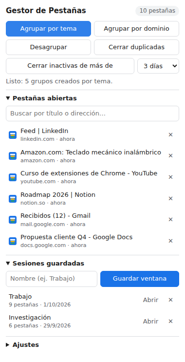

# Gestor de Pestañas Inteligente

Extensión de Chrome para poner orden cuando tienes demasiadas pestañas abiertas: las agrupa por tema, cierra las duplicadas y las inactivas, y guarda sesiones de trabajo con nombre.

### [⬇️ Descargar la extensión (.zip)](https://github.com/juanabraham8091/juanabraham8091/raw/main/gestor-pestanas/gestor-pestanas.zip)

## Instalación (2 minutos)

1. **Descarga** el archivo con el enlace de arriba.
2. **Descomprímelo.** Obtendrás una carpeta llamada `gestor-pestanas`.
3. En Chrome, escribe `chrome://extensions` en la barra de direcciones y pulsa Enter.
4. Activa el **Modo de desarrollador** (interruptor arriba a la derecha).
5. Pulsa **Cargar descomprimida** y selecciona la carpeta `gestor-pestanas`, la que contiene el archivo `manifest.json`.
6. Pulsa el icono de la pieza de puzle 🧩 junto a la barra de direcciones y fija **Gestor de Pestañas** para tenerla siempre a mano.

Funciona también en Edge, Brave y otros navegadores basados en Chromium.

## Funciones

- **Agrupar por tema**: crea grupos de colores como Desarrollo, Trabajo, Redes, Video y música, Compras, Noticias y Otros, según el sitio.
- **Agrupar por dominio**: junta en un grupo las pestañas del mismo sitio (por ejemplo, todas las de `github.com`).
- **Desagrupar** todo con un clic.
- **Cerrar duplicadas**: cierra las pestañas con la misma dirección y conserva la que estás viendo.
- **Cerrar inactivas**: cierra las pestañas que llevan 1, 3, 7 o 14 días sin usarse. Antes las guarda como sesión para que no pierdas nada.
- **Buscar** entre todas las pestañas abiertas, saltar a una con un clic o cerrarla.
- **Sesiones con nombre**: guarda la ventana actual (por ejemplo "Trabajo") y ábrela de nuevo cuando quieras.
- **Limpieza automática** (opcional): cada hora cierra las pestañas inactivas según el número de días que elijas.
- **Contador** de pestañas en el icono, que se pone en rojo cuando pasas de 30.
- **Atajos de teclado**: `Alt+Shift+G` agrupa por tema y `Alt+Shift+D` cierra duplicadas.

## Privacidad

Todo se queda en tu navegador (`chrome.storage.local`). La extensión no envía datos a ningún servidor y no necesita acceso al contenido de las páginas, solo a la lista de pestañas.

## Detalles técnicos

Hecha con Manifest V3 y JavaScript puro, sin dependencias ni paso de compilación.

| Archivo | Qué hace |
|---|---|
| `manifest.json` | Configuración y permisos (`tabs`, `tabGroups`, `storage`, `alarms`) |
| `tabs.js` | Lógica compartida: agrupar, cerrar, sesiones y ajustes |
| `background.js` | Service worker: contador, limpieza automática y atajos |
| `popup.html` / `popup.css` / `popup.js` | Ventana que se abre al pulsar el icono, con modo claro y oscuro |
| `icons/` | Iconos de la extensión |

Para añadir sitios a un tema o crear temas nuevos, edita la lista `TOPICS` de [`tabs.js`](tabs.js). Los colores válidos son `grey`, `blue`, `red`, `yellow`, `green`, `pink`, `purple`, `cyan` y `orange`.
